- Table of contents
{:toc}

本セミナーで使用する開発環境として Ubuntu Linux とその上で動作する ROS を利用します。<br>
本ページでは Ubuntu Linux と ROS のインストール方法を紹介します。

## 用意するもの

- WiFiへの接続が可能なノート型パソコンあるいはデスクトップPC

  *<span style="color: red">本手順によりパソコンの既存のOS（Windows等）及び保存されているデータやソフトウェアは完全に削除されます。予めバックアップを行ってください。</span>*
- インターネット接続
- 容量 4GB 以上の空 USB メモリ
- モニター１台
- キーボード
- HDMIケーブル
- マウス
- 容量 4GB 以上の空 SDカード(139回ロボット工学セミナー経由で実習キットを**購入されていない方のみ**)

## リモートPCセットアップ

### Ubuntu Linux のダウンロード

下記URLから Ubuntu 18.04 64bit Desktopのインストールイメージ、`ubuntu-18.04.x-desktop-amd64.iso`(xはバージョン番号)をダウンロードします。

   [Ubuntu 18.04 Bionic](http://jp.releases.ubuntu.com/bionic/)

* 本セミナーでは Ubuntu 18.04 64bit Desktop 版の使用を想定し、説明します
* ネットワーク環境によっては、インストールイメージのリンクをクリック後、実際にダウンロード開始するまで、10分ほど必要な場合があるようです
  <!-- https://ubuntu-news.org/2021/09/17/ubuntu-18-04-6-lts-released/ -->
   
   


### Live USB の作成

1. 下記 URL から、Live USB 作成ソフトをダウンロードします。
   - Windows、Mac OS Xの場合：<https://unetbootin.github.io/>

     ページ中の、Live USB 作成に使用しているPCのOSを選択してください。

     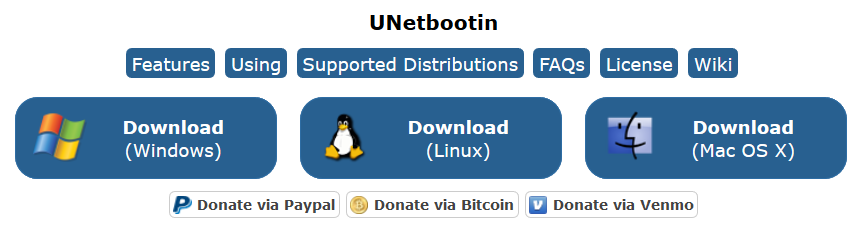

   - Linux (Debian/Ubuntu) の場合: 下記コマンドを実行

     ```shell
     $ sudo add-apt-repository ppa:gezakovacs/ppa
       ("[ENTER]を押すと続行します。"の表示後、Enterを入力)
     $ sudo apt-get update
     $ sudo apt-get install unetbootin
     ```

     <b>以降の説明は、Windowsを元に行います。</b>

1. 誤って必要なデータを削除してしまうのを防ぐため、使用しない USB メモリや、メモリーカードを取り外し、使用する USB メモリのみを接続します。<br>
使用する USB メモリは、ファイルが入っていない空の状態にして下さい。

   (Live USB を作成する PC と Ubuntu をインストール する PC はそれぞれ別でも構いません)

1. ダウンロードした unetbootin-windows-???.exe（Windows の場合）を実行します。<br>
   下記、「Windows によって PC が保護されました」画面が現れた場合は、「実行」ボタンをクリックしてください。

   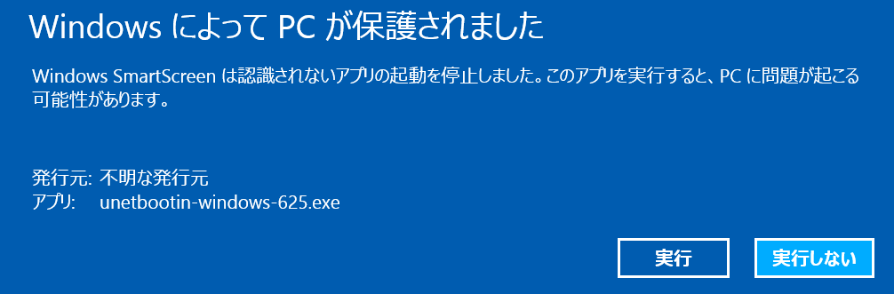

   また、下記のユーザアカウント制御画面が現れた場合、「はい」をクリックしてください。

   

1. UNetbootin の画面で、「ディスクイメージ」を選択し、「…」ボタンをクリックして先ほどダウンロードした`ubuntu-18.04.x-desktop-amd64.iso` ファイルを選択します。(x はダウンロードしたファイルに合わせて変更ください)<br>

    また、「スペースは、リブートしてもファイルを維持するために使用」欄に「4096」と入力し、「ドライブ」欄で、使用する USB メモリのドライブ名を選択します。<br>
  内容を確認後、「OK」をクリックしてください。

   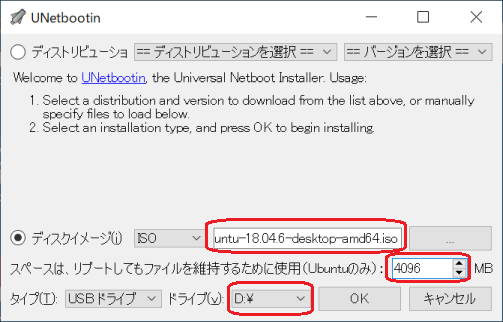

   書き込み完了までしばらく待機します。<br>
   USB2.0 の場合10分以上、書き込み速度の遅いメモリだと30分程度かかる場合があります。<br>

   また、以下のように、文字が描画されていないウィンドウが表示されることがあるようですが、ウィンドウ右上の「x」ボタンにより、ウィンドウを閉じても問題ないようです。

   

   下記の「永続性を設定する」画面で「応答なし」と表示される場合がありますが、正常に動作していますので、そのまま待機してください。

   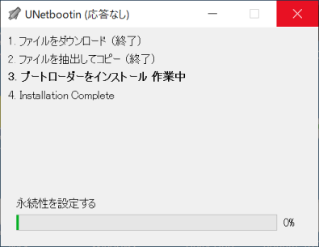

   下記画面が表示されれば、「Live USB」の作成は完了です。終了をクリックして下さい。

   

1. Live USBから起動するためのBIOSの設定を行います。

   セミナーで使用する PC の電源を切り、下記の手順で作成した Live USB を接続した状態で起動します。<br>
   起動時に、BIOS 設定画面に入ります。<span style="color: red">*PC のメーカー毎に BIOS への入り方が異なります*</span>ので、マニュアル等で確認してください。<br>
   下記の図は Acer での BIOS 設定画面の例です。

   

   BIOS 設定画面に入ったら、起動順（Boot order, Boot priority）の設定で、USB メモリが最優先になるように設定します。 （表示は使用している PC および USB メモリのメーカーによって異なります）

   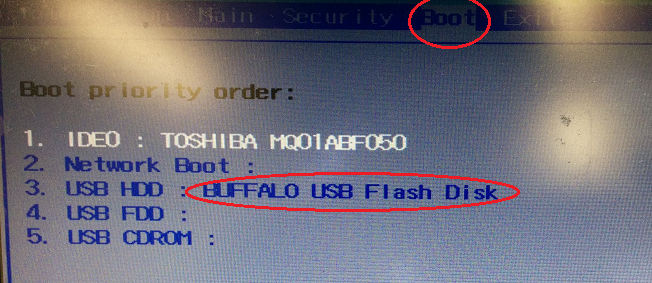

   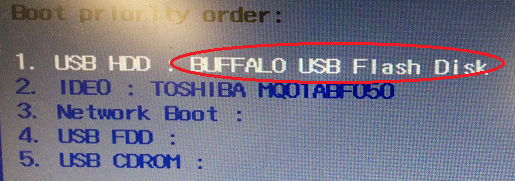

   設定を保存して再起動します。

   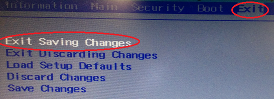

### Ubuntu Linux のインストール

1. Live USB をパソコンに接続し、パソコンの電源を入れます。

1. "GNU GRUB"のメニューの表示時、"Install Ubuntu"を選択します。

1. 以下の画面では言語を選択し、"続ける"を押します。その後、キーボードやネットワークに関しても環境に合わせて設定ください。

   

1. 以下の設定では、「通常のインストール」を選択してください。

   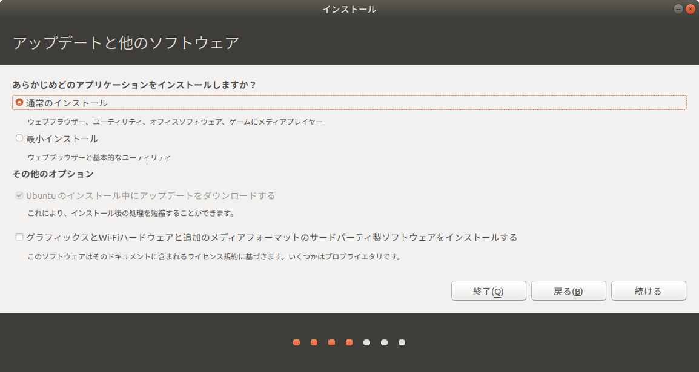

1. 以下の設定では、「ディスクを削除して Ubuntu をインストールする」を選択してください。

   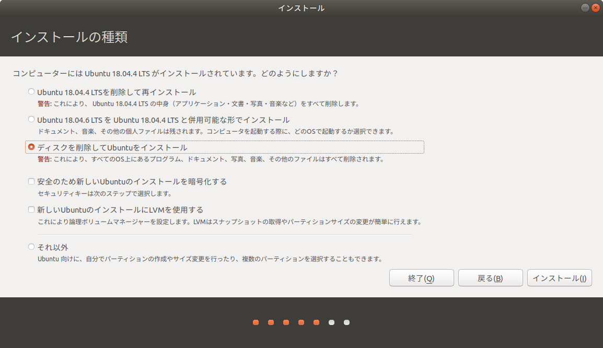

1. インストール完了後、<span style="color: red">*LiveUSBを未接続の状態で*</span>パソコンを再起動すると以下の画面が現れます。<br>
これで Ubuntu Linux のインストールが完了です。

   


### ROS Melodic ベースパッケージのインストール


>**注意**
>
>本章の内容は、TurtleBot3を制御する`リモートPC`(Ubuntu18.04がインストールされたデスクトップまたは、ノートパソコン)に対応しています。 **この手順は、TurtleBot3で実施しないでください。**


下記のスクリプトを使用すると、ROS Melodic(ROS)のインストール手順を簡略化できます。
ターミナルウィンドウでこのスクリプトを実行します。ターミナルアプリケーションは、画面の左上隅にあるUbuntu検索アイコンから起動できます。もしくは、ターミナルのショートカットキー`Ctrl+Alt+t`を使用して起動できます。 ROSをインストールした後、リモートPCを再起動してください。
<br><br>

**`【リモートPCで実施】`**
```shell
$ sudo apt-get update
$ sudo apt-get upgrade
$ wget https://raw.githubusercontent.com/ROBOTIS-GIT/robotis_tools/master/install_ros_melodic.sh
$ chmod 755 ./install_ros_melodic.sh 
$ bash ./install_ros_melodic.sh
```

**注釈**: インストールされるパッケージを確認するには、次のリンクを確認してください。

[install_ros_melodic.sh](https://raw.githubusercontent.com/ROBOTIS-GIT/robotis_tools/master/install_ros_melodic.sh)


上記のインストールが失敗した場合、以下を参考にしてください。
<!-- the words above are described in https://emanual.robotis.com/docs/en/platform/turtlebot3/quick-start/#pc-setup -->
[公式ROS1Melodicインストールガイド](http://wiki.ros.org/melodic/Installation/Ubuntu)

<!-- 
**注釈**:  
 - ROBOTISのROSパッケージはMelodic Moreniaをサポートしていますが、TurtleBot3にはROS Kinetic Kameを使用することを推奨します。
 - ROSをMelodic Moreniaにアップグレードする場合は、サードパーティのROSパッケージが完全にサポートされていることを確認してください。
<div class ="notice--info">{{info_01 | markdownify}}</div>
-->

### ROS 依存パッケージのインストール

リモートPCにROS依存パッケージをインストールする手順です。<br><br>

**`【リモートPCで実施】`**
```shell
$ sudo apt-get install ros-melodic-joy ros-melodic-teleop-twist-joy \
  ros-melodic-teleop-twist-keyboard ros-melodic-laser-proc \
  ros-melodic-rgbd-launch ros-melodic-depthimage-to-laserscan \
  ros-melodic-rosserial-arduino ros-melodic-rosserial-python \
  ros-melodic-rosserial-server ros-melodic-rosserial-client \
  ros-melodic-rosserial-msgs ros-melodic-amcl ros-melodic-map-server \
  ros-melodic-move-base ros-melodic-urdf ros-melodic-xacro \
  ros-melodic-compressed-image-transport ros-melodic-rqt* \
  ros-melodic-gmapping ros-melodic-navigation ros-melodic-interactive-markers
```

リモートPCにTurtleBot3を制御するための依存パッケージをインストールする手順です。
<br><br>

**`【リモートPCで実施】`**
```shell
$ sudo apt-get install ros-melodic-dynamixel-sdk
$ sudo apt-get install ros-melodic-turtlebot3-msgs
$ sudo apt-get install ros-melodic-turtlebot3
```

### TurtleBot3モデル名を設定

環境変数`TURTLEBOT3_MODEL`モデルにデフォルト名を設定します。以下のコマンドを端末に入力し、環境変数の設定と反映を行います。

**`【リモートPCで実施】`**
```shell
$ echo "export TURTLEBOT3_MODEL=burger" >> ~/.bashrc
$ source ~/.bashrc
```

`catkin_make`コマンドへのパスが通っていることを確認します。<br>
以下のコマンドを実行後、"/opt/ros/melodic/bin/catkin_make"といったパスが表示されれば、正しく設定できています。

**`【リモートPCで実施】`**
```shell
$ which catkin_make
```

何も表示されない場合、環境変数設定に不備が考えられるため、以下のコマンドを再実行してください。


**`【リモートPCで実施】`**
```shell
$ source ~/.bashrc
```

<a id="remotepc_wifi_settings"></a>
### ネットワーク構成


TurtleBot PCとリモートPCの間で通信をするためにIPアドレスが必要です。 **リモートPCとTurtleBot PCは、同じwifiルーターに接続する必要があります。**

`リモートPC`のターミナルウィンドウで次のコマンドを入力し、リモートPCのIPアドレスを確認します。
<br>

**`【リモートPCで実施】`**
```shell
$ ip address show
```

赤枠部分が、`リモートPC`のIPアドレスです。
(環境によってIPアドレスが異なる場合があります。また、"/24"の部分は含みません。)

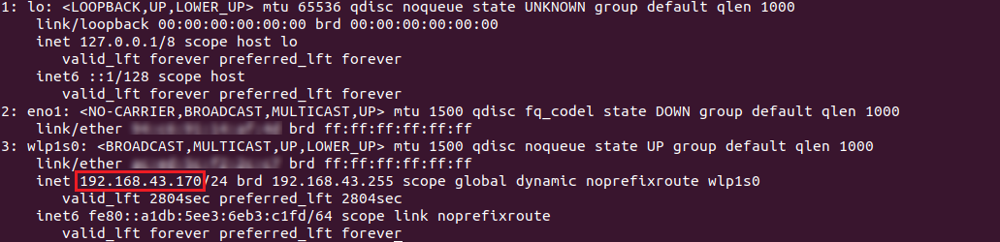

以下のコマンドを入力し、~/.bashrcを開きます。

**`【リモートPCで実施】`**
```shell
$ nano ~/.bashrc
```

`Alt + /` を入力するとファイルの最終行へ移動します。

`ROS_MASTER_URI`と`ROS_HOSTNAME`の`localhost`のIPアドレスを、上記のターミナルウィンドウから取得したIPアドレスに変更します。
(下図、赤枠部分)


修正後、ファイルを保存(`Ctrl + o` → `enter`)し、編集を終了（`Ctrl + x`）します。

次に、以下のコマンドでbashrcを実行します。

**`【リモートPCで実施】`**
```shell
$ source ~/.bashrc
```

以上でリモートPCの開発環境構築は完了です。


## 手順（TurtleBot制御コンピューター：Raspberry Pi 3+ セットアップ）


>**警告**
>- この章の内容は、**TurtleBot3 Burger**の制御コンピューターとなる `Raspberry Pi 3+(Raspberry Pi)`に対応しています。 **本項の設定内容をリモートPC（デスクトップPCまたは、ノートパソコン）で実施しないでください。**
>- セットアップ作業には、電源と時間が必要なためバッテリーは適していません。この作業では、SMPS(ACアダプタ)の使用を推奨します。


139回ロボット工学セミナー経由で実習キットを購入された方は、付属のSDカードに適切なイメージが記録されているので、下の[WiFiネットワーク設定を構成する](#tb3_wifi_settings)から実施ください。

もし、お持ちのTurtleBot3 BurgerにROS Melodicがインストールされていない場合、以下のHPより、Raspberry PiにROS Melodicのインストールを実施する必要があります。(画面上部のROSバージョン選択箇所において、'Melodic'を選択ください)

 3.2.1 "microSDカードとリーダーを準備する" ～ 3.2.4.2 "ディスクユーティリティ" まで実施ください。

https://emanual.robotis.com/docs/en/platform/turtlebot3/sbc_setup/#sbc-setup


<!-- ページ内リンクのおまじない -->
<a id="tb3_wifi_settings"></a> 
### WiFiネットワーク設定を構成する

1. TurtleBotの制御コンピュータであるRaspberry Pi(以下、SBC)を起動

   以下の手順で、SBCを起動し、ログインします。

   - キーボードをSBCのUSBポートに接続します。
   - SBC用起動イメージが格納されたmicroSDカードを、SBCに挿入します。

     `SBCに電力を供給する前に、HDMIケーブルを接続する必要があります。接続しないと、SBCのHDMIポートが無効になります。`

   - 電源を接続して、SBCをパワーオンします。
   - アカウント "ubuntu"、パスワード "turtlebot"でログインします。

1. 設定ファイルの修正
  
   修正対象ファイルを開く。

   **`【SBCで実施】`**
   ```shell
   $ cd /etc/netplan
   $ sudo nano 50-cloud-init.yaml
   ```

   エディターが開いたら、`WIFI_SSID`と`WIFI_PASSWORD`をWi-FiSSIDとパスワードに置き換えます。(下イメージ緑文字部分)

   

   修正後、ファイルを保存(`Ctrl + o` → `enter`)し、編集を終了（`Ctrl + x`）します。

   SBCを再起動します。

   **`【SBCで実施】`**
   ```shell
   $ sudo reboot
   ```

### ROSのネットワーク設定
SBCの再起動後、リモートPCのセットアップと同様([参照](#remotepc_wifi_settings))にSBCのIPアドレスを調べる（`wlan0`の箇所）。
   
**`【SBCで実施】`**
```shell
$ ip address show
```

エディタにて~/.bashrcを開きます。

**`【SBCで実施】`**
```shell
$ nano ~/.bashrc
```

下図のように、環境変数`ROS_MASTER_URI`と`ROS_HOSTNAME`のIPアドレスを、それぞれリモートPCのIPアドレスとSBCから取得したIPアドレスに変更します。

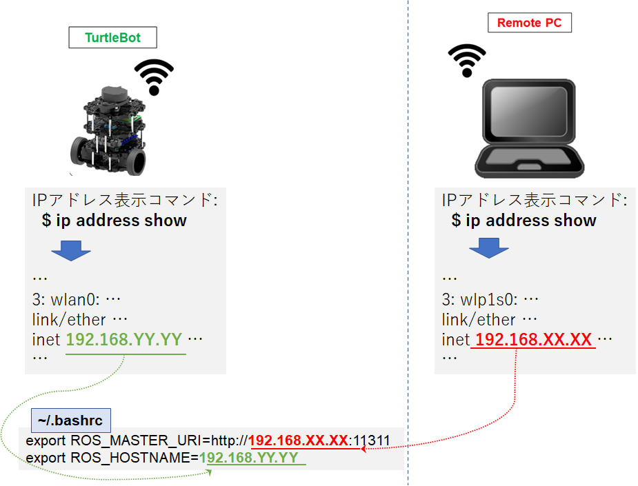


ファイルを保存し（`Ctrl + o` → `enter`)、閉じる（`Ctrl + x`）。

さきほど修正した設定を反映するため、**~/.bashrcを編集したターミナルにて、** 以下を実行します。
(~/.bashrcの修正により、今後、新規にターミナルを開いた時は自動で設定が反映されます)

**`【SBCで実施】`**
```shell
$ source ~/.bashrc
```

## リモートPCからSBCへの接続方法

ワイヤレス構成が完了したら、デスクトップまたはノートパソコンからSSH経由でSBCに接続できます。

まずは、リモートPCとSBCでSSHをインストールする。

SBCにログイン後、以下を実行する。

**`【SBCで実施】`**
```shell
$ sudo apt-get install ssh
```

SBCでSSHを有効にする。

**`【SBCで実施】`**
```shell
$ sudo service ssh start
$ sudo ufw allow ssh
```
 
リモートPCから、SBCに接続する。
リモートPCにログインし、以下を入力する。

**`【SBCで実施】`**
```shell-session
$ ssh ubuntu@192.168.YY.YY   (@の後はSBCのIPアドレス)
 ubuntu@192.168.YY.YY\'s password: (パスワード "turtlebot" を入力)
 (初めて接続する場合、接続を継続するかを問われるので、yesを入力する)
```


SBCに接続できれば、設定は問題なくできています。

接続できない場合、
- sshで指定しているIPアドレス、アカウント、パスワードに誤りがないか
- リモートPCとSBCを同じwifiルーターに接続しているか
 
を確認してください。

以上で、事前準備は終了です。

<br>

---

## ご参考
昨年度の" ロボットの作り方セミナー"にて、発生した問題についてまとめたテキストは以下になります。
ロボットが正常に動作しない場合に参考になさってください。

```
RSJロボット工学セミナー 第131回 レポート

Issue
ロボットとPCが通信できない。(ロボットが動作しない)
1. ROS_MASTER_URI、ROS_HOSTNAME(ROS_IP)が間違っている。
解決方法：適切な値に変更する。

2. 同一ネットワーク上にノードがない。(VMを使用した時に発生しやすい)
解決方法：同一ネットワーク上に配置する。

3. USBが断線している
解決方法：USBケーブルを挿し直す。OpenCRとRaspberryPiのUSBが抜けている事が多かった。

4. OpenCRのセットアップが終わっていない
解決方法：以下の手順を再度やり直す。

https://emanual.robotis.com/docs/en/platform/turtlebot3/opencr_setup/#opencr-setup

5. Dynamixelのケーブルが断線している
解決方法：ケーブルを挿し直す。

6. DYNAMIXELがブート(LEDは点灯)しているが動作しない。
解決方法：DYNAMIXEL Wizrd2.0を使用して再設定する。

※根本的な原因は不明だが、OpenCRのスイッチを押してDYNAMXIELの動作確認をする時にまれに変更される場合がある。

7. シミュレーションが動作しない
解決方法：初回起動で時間がかかっている場合が多い。

8. ビルドエラーが起きる。
解決方法：必要なパッケージがインストールされていない。

セットアップ手順をやり直す。

https://emanual.robotis.com/docs/en/platform/turtlebot3/quick-start/#pc-setup

もしくはrosdepを使って依存関係を解決する。

$ sudo apt-get install python-rosdep
$ rosdep init
$ rosdep update
$ rosdep install -i --from-paths path-to-ros-package
9. ノードを起動するとエラーが起きる。
解決方法：必要なパッケージがインストールされていない。

セットアップ手順をやり直す。

https://emanual.robotis.com/docs/en/platform/turtlebot3/quick-start/#pc-setup

もしくはrosdepを使って依存関係を解決する。

$ sudo apt-get install python-rosdep
$ rosdep init
$ rosdep update
$ rosdep install -i --from-paths path-to-ros-package
10. テレオペコマンドで前後逆に動作する。
解決方法：DYNAMIXELが左右逆に取り付けられているため、ハードウェアを組み直す。

https://emanual.robotis.com/docs/en/platform/turtlebot3/hardware_setup/#hardware-assembly

11. ノードは起動するが動作しない。
解決方法：PCとロボットの時刻がずれている。

ntpdateを使って同期する。

$ sudo apt-get install ntpdate
$ sudo ntpdate ntp.ubuntu.com
手動の場合は以下のコマンドで設定する。

$ date -s "01/22 13:00:00 2021"
12. ロボットモデルが読み込まれない。
解決方法：ロボットモデルの設定を読み込み直す。

$ export TURTLEBOT3_MODEL=burger
13. ネットワークの設定はあっているが動作しない
解決方法：.bashrcを読み込み直す。

$ source ~/.bashrc
※.bashrcは、ターミナルの起動時に読み込まれるので変更してから読み込み直さないと適応されない。

14. ROSのコマンドが使えない。
解決方法：ROSの環境設定を再度実施する。

$ source /opt/ros/<distro>/setup.bash
気づいた事
セットアップの手順が抜けていて失敗するケースが多い。

ネットワークの設定に失敗しているケースが多め。

次回に向けて改善してた方がいいこと¶
初期設定が想定通りに完了していることを確認する手順があるといい。

その他
セミナーの資料とセミナーで使用したコードをアップ
https://drive.google.com/drive/folders/1Z-5v747b3DJ_q0wX1W8yYGJh5KfFktKi?usp=sharing

コードは、以下にあるものと同様。
https://github.com/igra9/rsj_seminar_2021_navigation.git
コミットID：d6d679206fb7988a97be8e6db9d0c1091487b515

セミナーの資料は、以下にあるものと同様。(1年ほどでサイトが消える可能性あり)
https://igra9.github.io/ros_rsj_tutorial/obstacle-detection.html
```

