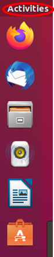
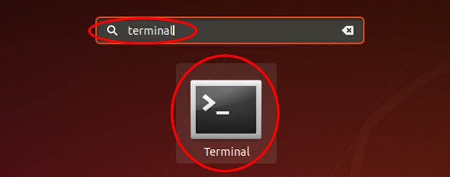
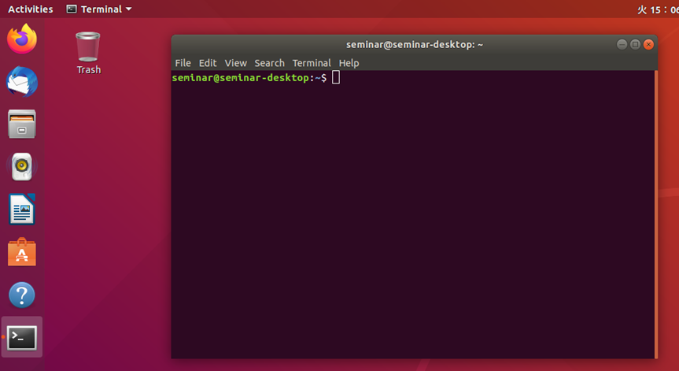
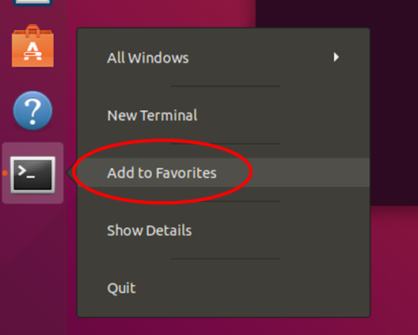

# Linuxの基本操作

- Table of contents
{:toc}

基本的なLinuxの端末操作方法を学習します。

最初は端末（ターミナル）を起動します。


新規インストールしたばかりのUbuntuであれば、画面左のランチャーに端末が表示されません。<br>
画面左上にある「Activities」をクリックします。



検索のための入力エリアが表示されるので、その入力エリアに「terminal」または「端末」を入力してください。



「Terminal」または「端末」を選択すると、以下のようにターミナルが起動します。



ランチャーにターミナルを登録し、検索せずに起動できるようにします。<br>
ランチャー内の端末のアイコンを右クリックし、「Add to Favorites」を選択します。



画面左のランチャーにある「端末」アイコンをクリックするとターミナルが起動します。

ウインドウが開き、下記のような文字列が表示されます。

```shell
ubuntu@ubuntu:~$
```

これは、__ユーザID__@__コンピュータ名__:__現在のディレクトリ__$」を表しており、 __現在のディレクトリ__ 欄の「~」(チルダ)は、現ユーザのホームディレクトリを表します。

## ディレクトリ操作 (ls, cd コマンド)

現在のディレクトリにある、ファイル、ディレクトリは、lsコマンドで表示できます。

```shell
ubuntu@ubuntu:~$ ls
catkin_ws examples.desktop Desktop  Documents  Downloads  Music  Pictures Public Templates Videos
ubuntu@ubuntu:~$
```

（各ディレクトリは日本語で表示されること場合があります。）

現在のディレクトリは、cdコマンドで移動できます。<br>
以下のように、cdコマンド実行後、 __現在のディレクトリ__ 欄が変化していることが確認できます。

```shell
ubuntu@ubuntu:~$ cd Downloads
ubuntu@ubuntu:~/Downloads$
```

「..」 は、一つ上のディレクトリを意味します。

```shell
ubuntu@ubuntu:~/Downloads$ cd ..
ubuntu@ubuntu:~/$
```

また、cdコマンドをディレクトリを指定せずに実行すると、ホームディレクトリに戻ります。

```shell
ubuntu@ubuntu:~$ cd Downloads
ubuntu@ubuntu:~/Downloads$ cd
ubuntu@ubuntu:~$
```

以降、コマンド入力など端末を使用する場合、通常は表示される、ユーザID、コンピュータ名、ディレクトリは省略し、下記のように表記します。

```shell
$ ls
examples.desktop Desktop  Documents  Downloads  Music  Pictures Public Templates
Videos
$
```

## ディレクトリ作成 (mkdir コマンド)

指定した名前のディレクトリを作成します。

以下の例では、テンポラリディレクトリ(`/tmp/`)に、`test-directory`という名前のディレクトリを作成します。ただし、すでに同名のディレクトリが存在する場合、エラーが発生します。<br>
(テンポラリディレクトリはPCシャットダウン時にクリアされて空になります。)

```shell
$ cd /tmp/
$ ls
...
$ mkdir test-directory
$ ls
...  test-directory
```

## Tabキーを用いたコマンド補完

Linuxの端末でコマンドを入力する際、途中まで入力した後に `Tab`{: style="border: 1px solid black" } キーを押すと、可能な場合には、自動的にコマンドを補完してくれます。<br>
補完されない場合、もう少しコマンドを入力してから`Tab`{: style="border: 1px solid black" } キーを押すと、補完されることがあります。

```shell
$ cd ~/M [Tab]
$ cd ~/Music/
```

## 実行中のプログラムの停止

実行しているコマンドを途中で止めたい場合には、`Ctrl+c`{: style="border: 1px solid black" }を入力します。<br>
下記の例は、`yes`コマンド(`y`と表示し続けるコマンド)を実行し、 `Ctrl+c`{: style="border: 1px solid black" }で停止します。

```shell
$ yes
y
y
y
y
[Ctrl+c]
^C
$
```

## コピー＆ペースト

端末の画面中でのコピー＆ペーストには、キー入力で行う方法と、マウスのみで行う方法があります。<br>
キー入力で行う際は、コピーしたい文字列を選択して `Ctrl+Shift+c`{: style="border: 1px solid black" }でコピー、`Ctrl+Shift+v`{: style="border: 1px solid black" }でペーストします。

```shell
$ cd
$ ls
examples.desktop  Desktop  Documents  Downloads  Music  Pictures Public Templates Videos
["Desktop"を選択して Ctrl+Shift+c]
$ cd [Ctrl+Shift+v]
   ↓
$ cd Desktop
```

なお、ブラウザなどターミナル以外のソフトでは、`Ctrl+c`{: style="border: 1px solid black" }でコピーができます。

マウスのみでコピー＆ペーストを行う際は、コピーしたい文字列を選択して、そのまま中ボタンをクリックすることで、ペーストします。

```shell
$ cd
$ ls
examples.desktop  Desktop  Documents  Downloads  Music  Pictures Public Templates
Videos
$ cd ["Descktop"を選択して中クリック]
   ↓
$ cd Desktop
```

## ターミナルを複数開く

ロボットのプログラムを実行する際、複数のターミナルウインドウを使って操作する場合があります。<br>
事前に端末をクリックするなどして端末をアクティブにし、`Ctrl+Shift+n`{: style="border: 1px solid black" }で新しいウインドウを、`Ctrl+Shift+t`{: style="border: 1px solid black" }で新しいタブを開くことができます。

## コマンドの履歴

ターミナルのコマンド入力時に、上キーを押すと、これまでに入力したコマンドを再度呼び出すことができます。

```shell
$ [上下キー]
```

<button type="button" class="bth btn-primary btn-lg">[
    <span style="color:black">**メインページへ**</span>](index.html)</button>
<button type="button"  class="bth btn-success btn-lg">
    [<span style="color:black">**次の実習へ**</span>](ros_basics.md)</button>
